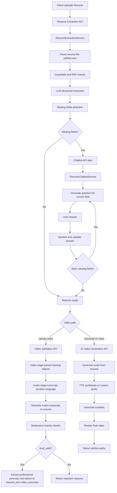

# Resume Intelligence Pipeline

This project processes a candidate resume, fills missing data through a chatbot flow, and then supports two video paths:
- Upload and validate a user video against the resume
- Generate an AI intro video from the resume

## End-to-End Flow



## Flow Explanation

1. Resume ingestion and extraction
- Input file can be `pdf`, `docx`, or `txt`.
- The extractor parses raw text, runs validation/guardrails, calls LLM extraction, and returns:
  - `resume_json`
  - `missing_fields`

2. Chatbot completion loop
- If `missing_fields` is not empty, chatbot starts a user session.
- For each missing field:
  - system asks one focused question
  - user answers (or types `skip`)
  - sanitizer and LLM validation run before storing the value
- When fields are complete, chatbot returns final `resume` object.

3. Video decision
- Path A: user uploads a video for validation.
- Path B: system generates an AI intro video from resume data.

4. Video validation path
- Stages: `video`, `audio`, `semantic`, `moderation`, then final decision.
- If approved (`final_valid: true`), a professional `video_summary` is generated and attached into resume JSON.
- If rejected, response includes per-stage reasons and errors.

5. AI generation path
- Generates introduction script from resume.
- Produces audio (TTS or provided custom audio), subtitles, and final rendered video.
- Returns artifact locations and generation config.

## API Modules

Each module is an independent FastAPI app.

- `Resume/delivery/api/resume_extraction_api.py`
- `Resume/delivery/api/chatbot_routes.py`
- `Resume/delivery/api/video_validation_api.py`
- `Resume/delivery/api/ai_video_generation_api.py`

## Endpoints

### Resume Extraction API
- `GET /health`
- `POST /resume/extract/path`
- `POST /resume/extract/file`

Example (`/resume/extract/path`):

```bash
curl -X POST http://127.0.0.1:8001/resume/extract/path \
  -H "Content-Type: application/json" \
  -d '{
    "user_id": "user123",
    "file_path": "D:/path/to/resume.pdf",
    "file_type": "pdf"
  }'
```

### Chatbot API
- `GET /health`
- `POST /chatbot/start`
- `POST /chatbot/answer`
- `GET /chatbot/session/{user_id}`
- `DELETE /chatbot/session/{user_id}`

Example (`/chatbot/start`):

```bash
curl -X POST http://127.0.0.1:8002/chatbot/start \
  -H "Content-Type: application/json" \
  -d '{
    "user_id": "user123",
    "resume_json": {"name": "Alex"},
    "missing_fields": ["email", "skills"]
  }'
```

Example (`/chatbot/answer`):

```bash
curl -X POST http://127.0.0.1:8002/chatbot/answer \
  -H "Content-Type: application/json" \
  -d '{
    "user_id": "user123",
    "answer": "alex@example.com"
  }'
```

### Video Validation API
- `GET /health`
- `POST /video/validate/path`
- `POST /video/validate/file`

Example (`/video/validate/path`):

```bash
curl -X POST http://127.0.0.1:8003/video/validate/path \
  -H "Content-Type: application/json" \
  -d '{
    "user_id": "user123",
    "video_path": "D:/path/to/intro.mp4",
    "resume_json": {"name": "Alex", "skills": ["Python"]}
  }'
```

### AI Video Generation API
- `GET /health`
- `POST /ai-video/generate`

Example:

```bash
curl -X POST http://127.0.0.1:8004/ai-video/generate \
  -H "Content-Type: application/json" \
  -d '{
    "user_id": "user123",
    "resume_json": {"name": "Alex", "skills": ["Python"]},
    "provider": "groq",
    "voice_id": "female"
  }'
```

## Running Locally

1. Install dependencies

```bash
pip install -r requirements.txt
```

2. Set environment variables (minimum)
- `GROQ_API_KEY` for LLM-backed extraction/chatbot/generation.

3. Start each API in separate terminals

```bash
uvicorn Resume.delivery.api.resume_extraction_api:app --host 0.0.0.0 --port 8001 --reload
uvicorn Resume.delivery.api.chatbot_routes:app --host 0.0.0.0 --port 8002 --reload
uvicorn Resume.delivery.api.video_validation_api:app --host 0.0.0.0 --port 8003 --reload
uvicorn Resume.delivery.api.ai_video_generation_api:app --host 0.0.0.0 --port 8004 --reload
```

## Core Business Objects

- `resume_json`: structured profile generated from resume and chatbot updates.
- `missing_fields`: list of fields chatbot still needs.
- `final_valid`: final approval result from video validation pipeline.
- `video_summary`: professional summary extracted from validated/uploaded video transcript.

## Notes

- Chatbot session storage is currently in-memory (`MemoryStateStore`), so sessions reset on restart.
- Video validation can run without resume JSON, but semantic checks are skipped in that case.
- AI video generation writes artifacts under `tmp/ai_video_output/<user_id>` by default.
